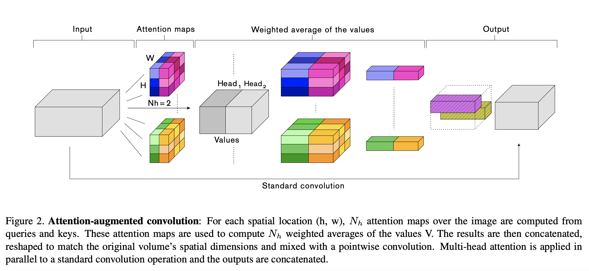
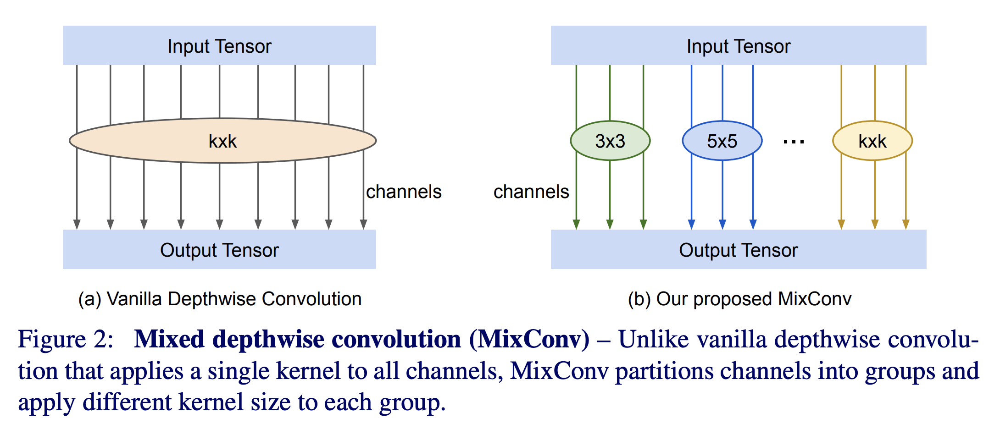
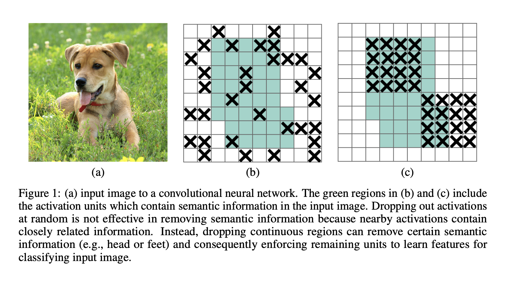
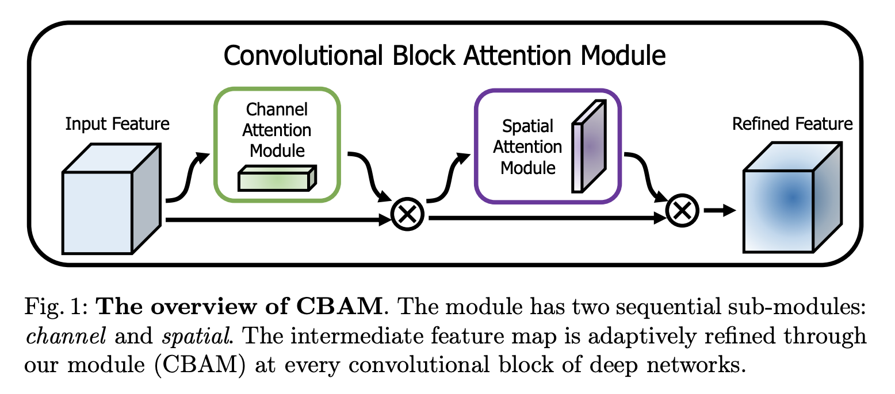

# Convolution Variants
This repository replicates various convolution layers from SOTA papers.

This repository currently includes:
* [Attention Augmented (AA) Convolution Layer](#Attention-Augmented-Convolution-Layer)
* [Mixed Depthwise Convolution Layer](#Mixed-Depthwise-Convolution-Layer)
* [Drop Block](#Drop-Block)
* [Efficient Channel Attention (ECA) Layer](#Efficient-Channel-Attention-Layer)
* [Convolutional Block Attention Module (CBAM) Layer](#Convolutional-Block-Attention-Module-Layer)


## Attention Augmented Convolution Layer



For other implementations in:
* Pytorch: [leaderj1001](https://github.com/leaderj1001/Attention-Augmented-Conv2d)
* Keras: [titu1994](https://github.com/titu1994/keras-attention-augmented-convs)
* TensorFlow 1.0: [gan3sh500](https://github.com/gan3sh500/attention-augmented-conv) 


### Notes

* This implementation does not yet include relative positional encodings.


## Mixed Depthwise Convolution Layer



For other implementations in:
* TensorFlow 1.0: [Tensorflow](https://github.com/tensorflow/tpu/tree/master/models/official/mnasnet/mixnet)

### Notes

* This implementation combines depthwise convolution with pointwise convolution. The original implementation only used depthwise convolutions.


## Drop Block



For other implementations in:
* TensorFlow 1.0: [Tensorflow](https://github.com/tensorflow/tpu/blob/master/models/official/resnet/)
* Pytorch: [miguelvr](https://github.com/miguelvr/dropblock)


## Efficient Channel Attention Layer


## Convolutional Block Attention Module Layer




# Usage

Here is an example of how to use this layer:

```
import tensorflow as tf
from AAConv import AAConv

aaConv = AAConv(
    channels_out=32,
    kernel_size=3,
    depth_k=8, 
    depth_v=8, 
    num_heads=4)
```

The layer can be treated like any other `tf.keras layer`.

```
model = tf.keras.models.Sequential([
    aaConv,
    tf.keras.layers.Flatten(),
    tf.keras.layers.Dense(128, activation='relu'),
    tf.keras.layers.Dropout(0.2),
    tf.keras.layers.Dense(10, activation='softmax')
    ])

model.compile(
    optimizer='adam',
    loss='sparse_categorical_crossentropy',
    metrics=['accuracy'])

model.fit(x_train, y_train, epochs=5)
```


# General Notes:

* These layers are only tested to work for input format: NCHW. Existing implementations (see Acknowledgements) using format NHWC.

* Test cases are located [here](https://github.com/JinLi711/Convolution_Variants/blob/master/Convolution_Variants/tests.py). 


# Requirements

* tensorflow 2.0.0 with GPU


# Acknowledgements

Links to the original papers:
* [Attention Augmented Convolutional Networks](https://arxiv.org/pdf/1904.09925v4.pdf)
* [Mixed Depthwise Convolution Layer](https://arxiv.org/pdf/1907.09595v2.pdf)
* [Drop Block Layer](https://papers.nips.cc/paper/8271-dropblock-a-regularization-method-for-convolutional-networks.pdf)
* [Efficient Channel Attention Layer](https://arxiv.org/abs/1910.03151)
* [Convolutional Block Attention Module Layer](https://arxiv.org/abs/1807.06521)